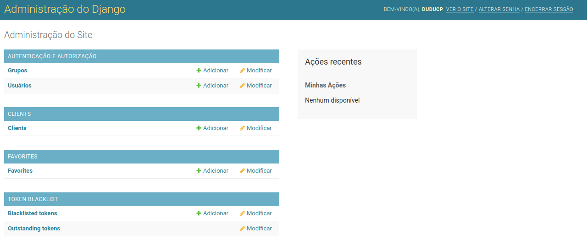
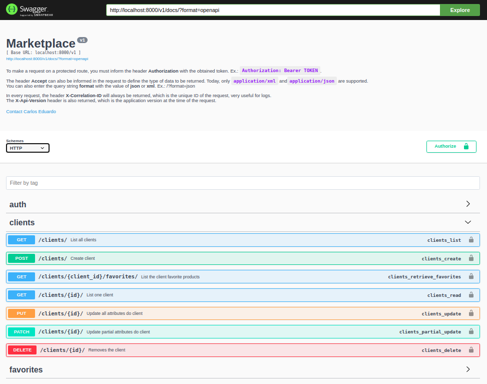
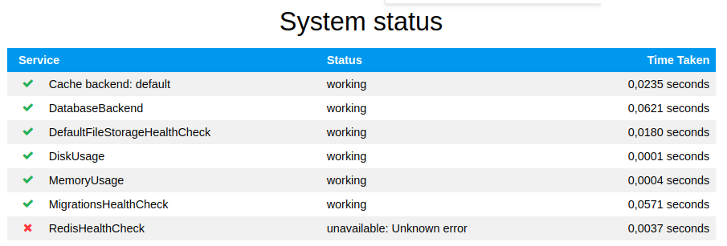

# Marketplace

Project created with **Django** using the command `django-admin startproject marketplace .`

Main dependencies:
- Django (framework)
- djangorestframework (toolkit for building Web APIs)
- drf-yasg (api documentation)

Features:
- API Restfull and Django Admin
- API Restfull documentation
- Versioning API Restfull routes
- Application versioning with changelogs
- Structured logs
- Cache and CacheLock configured for Redis
- Health check
- Unit testing and contract testing
- Dockerized application

# Navigation
- [Development mode](#ancora1)
- [Deploying in production](#deploying_prod)
- [Deploying on Heroku](#deploying_heroku)
- [Create new app](#create_app)
- [Migrate and migration](#migrate_migration)
- [Renderer and parser data](#renderer)
- [Application route versioning](#app_route_versioning)
- [Application code versioning](#app_versioning)
- [Correlation ID](#correlation_id)
- [Throttles](#throttles)
- [Docker](#docker)
- [Images](#images)

<a id="development_mode"></a>
## Development mode

First, you must configure the virtual environment:
```shell script
python -m venv venv
```

After that activate virtualenv:
```shell script
source venv/bin/activate
```

Finally run the command to install the development dependencies:
```shell script
make dependencies
```

To access the admin it is necessary to create the superuser. This can be done
with the following command:

```shell script
make superuser
```

<a id="deploying_prod"></a>
## Deploying application in production

To deploy to production the following environment variables must be defined:
```shell script
export SIMPLE_SETTINGS=marketplace.settings.production
export DJANGO_SETTINGS_MODULE=marketplace.settings.production
export SECRET_KEY="your_key_here"
export DATABASE_URL="sqlite:///db.sqlite3"
```

Optionals:
```shell script
export ALLOWED_HOSTS="*;"
```

<a id="deploying_heroku"></a>
### Deploying on Heroku
I am assuming that you already know [Heroku](https://dashboard.heroku.com/apps)
and that you have already installed the CLI and logged in.

The first thing to do is to create the app on Heroku and this can be done with
the command `heroku create <name-app>`. After creating the app, the CLI itself
will add _git remote_ to you in your Django project.

The next step is to send your project to Heroku with the command
`git push heroku master -f`.

Now it's time to set the environment variables in Heroku:
```shell script
heroku config:set DEBUG="False"
heroku config:set SIMPLE_SETTINGS=marketplace.settings.production
heroku config:set DJANGO_SETTINGS_MODULE=marketplace.settings.production
heroku config:set SECRET_KEY="your_key_here"
```

To configure the [Postgres](https://devcenter.heroku.com/articles/heroku-postgresql)
database, simply run the command `heroku addons:create heroku-postgresql:hobby-dev`.

To configure the [Redis](https://elements.heroku.com/addons/heroku-redis)
database, simply run the command `heroku addons:create heroku-redis:hobby-dev`.

By running the two commands above, Heroku will create two environment variables
called DATABASE_URL and REDIS_URL.

With the database configured, we can run migrations with the command
`heroku run make migrate`.

The last step is to create the super user for Django Admin:
```shell script
heroku run bash
make superuser
```

The first command we are accessing Heroku's bash and the second we are using to
create the super user.

Others commands:
- **heroku config** view application environment variables
- **heroku logs --tail** view application logs
- **heroku addons** view installed addons
- **heroku addons:open <name_addon>** opens the panel for a particular addon
- **heroku pg:psql** open postgres shell
- **heroku redis:cli** open redis shell

Note:

Heroku looks at the file **Procfile** in order to detect the
applications that should be run. It automatically identifies that it is a
Django application and runs some commands during application startup, as well
as **collectfiles**. In this file there is a **release** command, it will be
executed after the application initialization and it is not a specific
application. The **runtime.txt** file is used to specify the version of python
that Heroku should use.

<a id="create_app"></a>
### Create new app
All new apps are created in the _ecommerce/apps_ directory and to create a new
app you can run the following command:
```shell script
make app name=clients
```

Note that the _name_ parameter has been passed. It is used to inform the name
of the application.

<a id="migrate_migration"></a>
### Migrate and migration
If you've just set up your model, it's time to create the schema to be applied
to the database in the future. Notice that in your app there is a folder with
the name of **migrations**, this is where the schematics of your model will
stay.

To create the schema we need to execute the following command:
```shell script
make migration
```

You can also create a blank layout, which in turn will not be related to any
model at first:
```shell script
make migration-empty app=clients
```

Note that the _app_ parameter has been passed. It is used to tell which app the
schema should be created in.

Now we need to apply this schema to the database and for that we execute the
following command:
```shell script
make migrate
```

<a id="renderer"></a>
### Renderer and parser data
- Json

To receive the data in **json** format you can send the `Accept` header of type
`application/json` or pass the `format=json` parameter in the url.

If **json** data is sent you can set the `Content-Type` header to
`application/json` type.

- XML

To receive the data in **xml** format you can send the `Accept` header of type
`application/xml` or pass the `format=xml` parameter in the url.

If **xml** data is sent you can set the `Content-Type` header to
`application/xml` type.

<a id="app_route_versioning"></a>
### Application route versioning
This application is prepared for new versions of routes. Usually a new route
version is generated when the contract is changed. By default this application
is in version 1.0 and you notice this when you make a request by passing
**/v1** in the url.

In the file `marketplace/urls.py` there is a list of urls called **routers_v1**
and in the list **urlpatterns** we include it informing the namespace equal
to _v1_.

In the basic settings of the application, there are the settings of
**REST_FRAMEWORK** and we can find a parameter called **DEFAULT_VERSION** which
is where we define the standard version of the application.

There is also another parameter called **ALLOWED_VERSIONS** which is where the
versions supported by the application are informed and if you are going to
create new versions, you must inform them in that parameter.


<a id="app_versioning"></a>
### Application code versioning
As a good practice it is always good to create a _changelog_ file in each
completed task in order to keep a history of the change. For that we have some
commands:

- changelog-feature: signifying a new feature
- changelog-bugfix: signifying a bug fix
- changelog-doc: signifying a documentation improvement
- changelog-removal: signifying a deprecation or removal of public API

Each of these commands expects the **filename** and **message** parameter. You
can use them as follows:

```shell script
make changelog-feature filename="create-crud-client" message="Adds CRUD for clients management"
```

When a story is finished it is time to create a new version for the
application. All _changelog_ files in existence will be converted to a single
message that will be available in the _CHANGELOG_ file.

There are three commands that we use to close the version. Are they:

- release-patch: create patch release eg 0.0.1
- release-minor: create minor release eg 0.1.0
- release-major: create major release eg 1.0.0

You can use them as follows:
```shell script
make release-patch
```

After running the specific command, two new commits will be created, one
referring to the generation of the changelog file and the other referring to
the generation of the new version of the application. In addition to these new
commits, a specific tag for the application version is also generated.

Finally, you can submit all changes to your git repository with the `make push`
command.

### Logs
The application logs are more powerful and less painful with the help of
**structlog** which is intermediated by `django-structlog`. All logs made are
converted to JSON, thus facilitating their search, since they are keyed.

For you to use them just follow the code below:
```python
import structlog
logger = structlog.get_logger(__name__)

logger.info("User logged in", user="test-user")
```

<a id="correlation_id"></a>
### Correlation ID
This application uses [django-correlation-id](https://django-correlation-id.readthedocs.io/)
to do the management.

The correlation is injected into the logs and returned in the header of each
request. The user can send it in the request header (X-Correlation-ID) or if it
is not found, the application will automatically generate it.

<a id="throttles"></a>
### Throttles
Throttles is one more security that you can configure in the application.
With it you can limit the number of requests that the API can receive, either
for seconds, minutes, hours or days, for registered or anonymous users.

By default, the application is configured to limit 50 requests per second for
anonymous users. This setting is set in the settings in the REST_FRAMEWORK
section.

For more information you can consult the [official documentation](https://www.django-rest-framework.org/api-guide/throttling/).

<a id="docker"></a>
### Docker
This application makes use of Docker to facilitate during development and if
necessary for production.

Before executing the commands, make sure you have the docker installed on your
device.

See the commands available in the Makefile:
- **docker-run**: Will create the docker image and run the container.
- **docker-migrate**: Will apply the migrations to the database configured in the docker.
- **docker-flush**: Will delete all data from the database tables.
- **docker-createsuperuser**: Will create the Django super user in the database.
- **docker-shell**: Will grant you access to the Django shell.
- **docker-logs**: Will show the docker container logs.
- **docker-down**: Will remove all containers and networks from the docker for the project.

<a id="images"></a>
## Images
- Admin



- Documentation



- Health Check

It can be ordered in JSON format as well. Just add the parameter `?format=json`
to the end of the URL.

